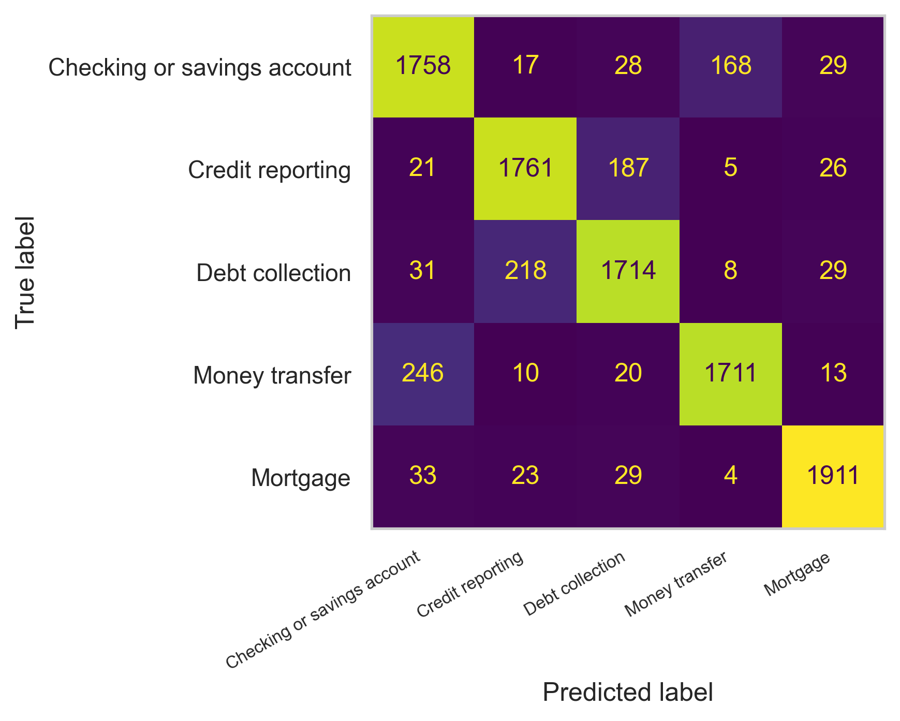
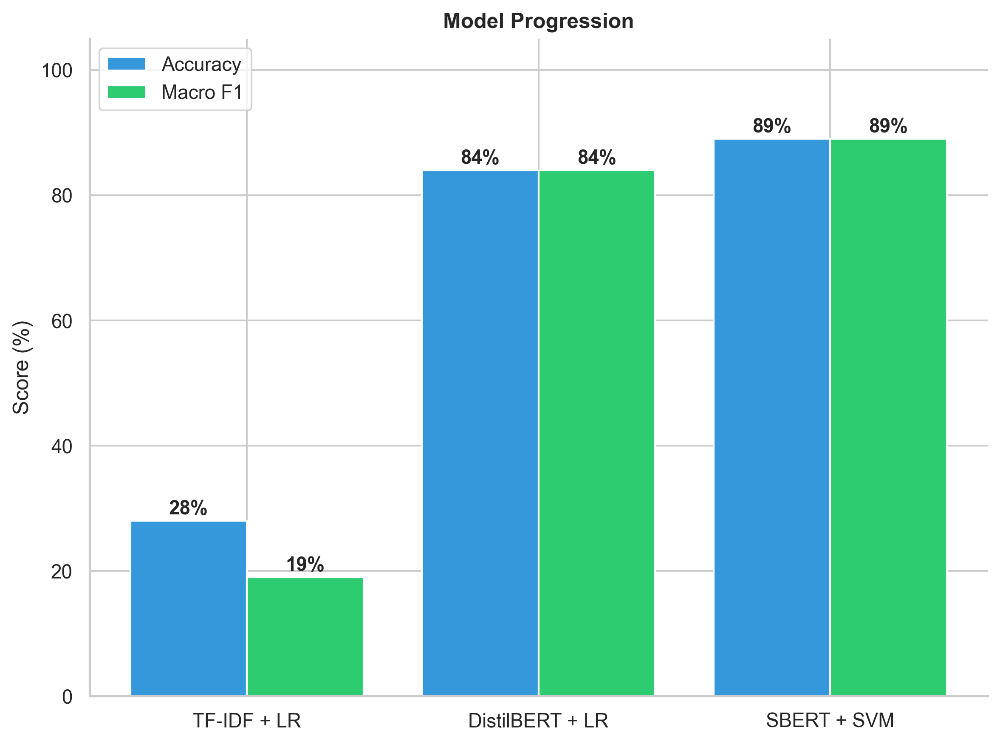
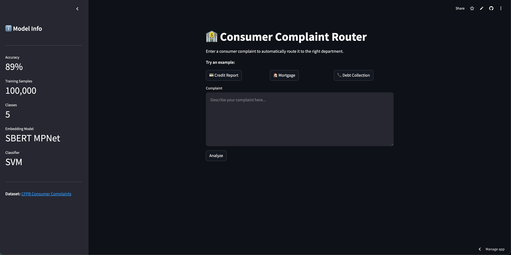

# Consumer Complaint Router
A natural language processing system that reads a consumer complaint, routes it to the right department, and summarizes it. Trained on 50K real complaints from the CFPB dataset.

# Project Overview
This project builds an end-to-end NLP pipeline that takes real consumer complaints from the CFPB (Consumer Financial Protection Bureau) dataset and (1) classifies them into the correct department, and (2) summarizes the complaint. A Streamlit web app was built that serves as the live demo.

# Pipeline Architecture
Raw CFPB data > Data cleaning > Balancing > SBERT embedding(final) > linearSVM(final classification) > LSA summarizer > Streamlit app

# Dataset and preprocessing
The dataset is huge and has 3.7M rows. The two key columns used are 'Consumer complaint narrative' (the raw text) and 'Product' (the label/department). I dropped rows with missing customer narratives. Two near identical categories were merged into single 'Credit reporting' class and top 5 classes were used for further analysis. Each class was capped at 20,000 samples using groupby + sample(). This gives 100,000 total balanced samples and prevents any single class from dominating training.

# Classification
Attempt 1: TF-IDF + logistic regression (Accuracy 28% , Macro F1 19%) - Not good, despite balanced datasets macro F1 < Accuracy, suggesting sementic issues. 

Attempt 2: DistilBert + logistic regression (Accuracy 84%, Macro F1 84%) - Model performance improved significantly because model understands sentence context. This works generally, but it was never trained to produce good sentence level representations.

Attempt 3: SBERT + SVM (Accuracy 89%, Macro F1 89%) - Model performance improved and got us closer to the production level. Sentence-BERT was fine-tuned specifically to produce semantically meaningful sentence embeddings. This makes it much better suited for classification tasks.

# Final Confusion Matrix

# Model Comparison

# Summarization 
I used LSA (Latent Semantic Analysis) extractive summarization via the sumy library. The extractive means it picks the most important existing sentences and does not generate any new text. In this case, I use top 2 sentences. 

# Streamlit App
This final step combines classification and summarization into a single process_complaint() function, then wraps it in a Streamlit UI (Used chatbot's help and modified accordingly).

# Features:
- Automatic routing of complaints to the right department
- Summarizes complaints using LSA summarization
- Shows department confidence in a horizontal bar chart
- Shows clickable sidebar for model stats (accuracy, dataset size, model used) 
- Example buttons for quick testing
- Built with **Streamlit**, **Sentence Transformers**, **SVM**, and **Sumy**

## Demo

Try the app live on Streamlit Cloud:  
[Consumer Complaint Router](https://nlp-consumer-complaint-router.streamlit.app/)

